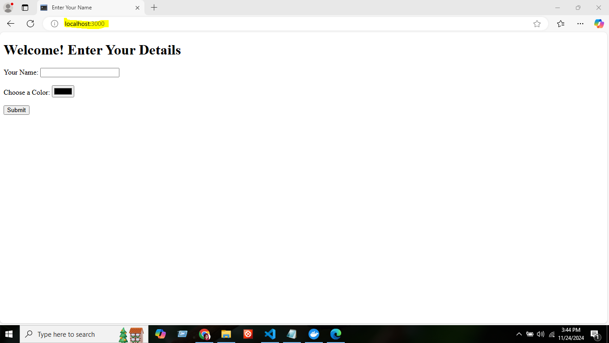
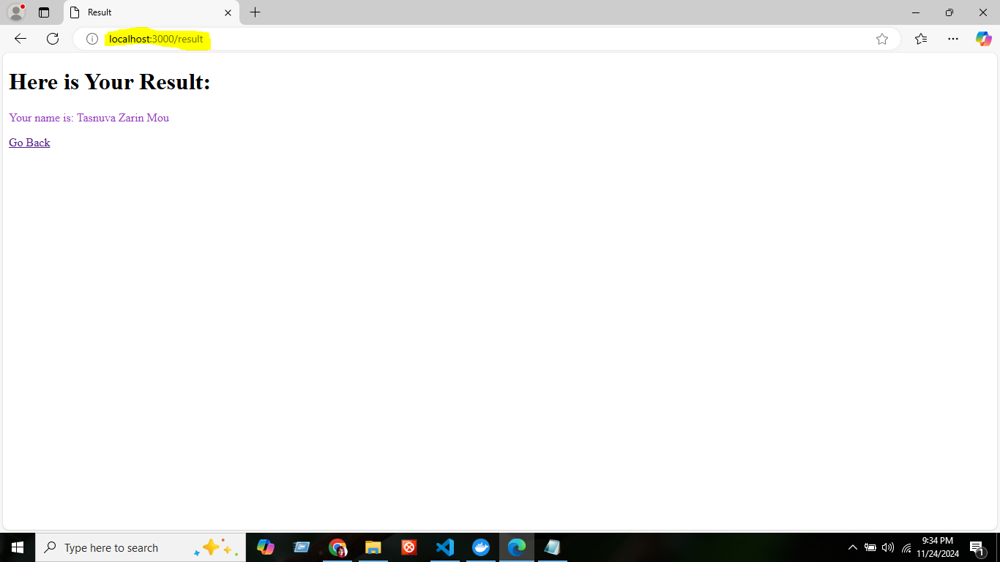

# Flask App with Docker

This is a simple Flask Application that displays a form on the homepage and processes user input to display a result. The application is Dockerized for easy deployment and portability.

## Features
- Displays a form with fields for user input (`name` and `color`).
- Processes the form submission and renders a result page.
- Suppose, one has input his/her name and selected a color, the output will print the name in that color.
- Dockerized for seamless setup and deployment.

## File Structure

├── app.py # Main Flask application 

├── templates/ 

│ ├── form.html # HTML template for the form

│ ├── result.html # HTML template for the result 

├── Dockerfile # Docker configuration file  

├── requirements.txt # Python dependencies

## Dockerfile breakdown

# Use a base image with Python
FROM python:3.11-slim

# Set the working directory inside the container
WORKDIR /app

# Copy all project files to the container
COPY . /app

# Expose port for running the flask app in Docker Container
EXPOSE 5000

# Install dependencies
RUN pip install --no-cache-dir -r requirements.txt

*requirements.txt file contains the following to run the Flask app that we are dockerizing: 
Flask==2.3.3
colorama==0.4.6

# Specifying the command to run the Flask app
CMD ["python", "app.py"]

## Build the Docker Image
docker build -t final-color .

## Run the Container
docker run -d -p 3000:5000 final-color

## The application will be accessible at
http://localhost:3000

## Preview

